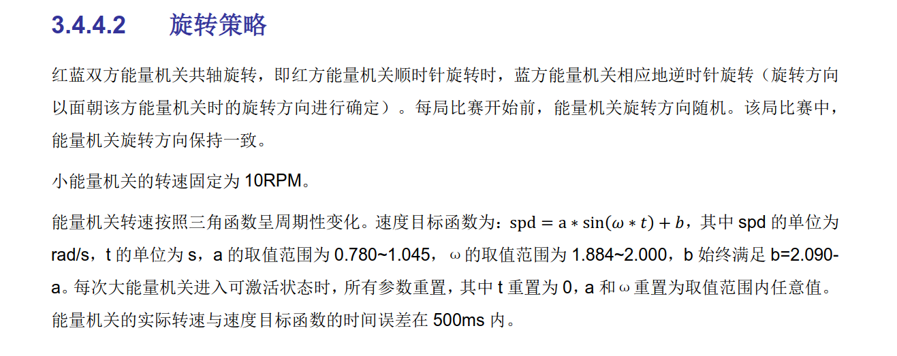
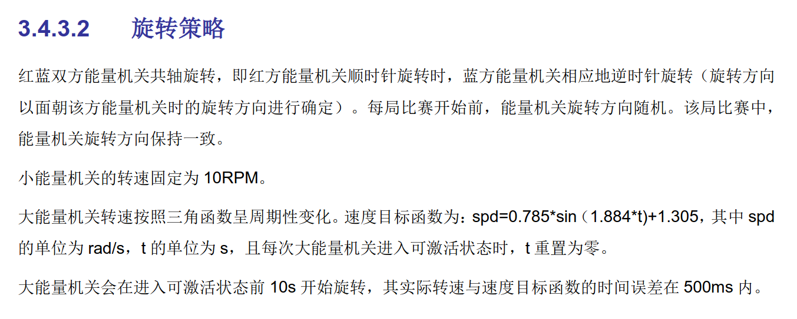
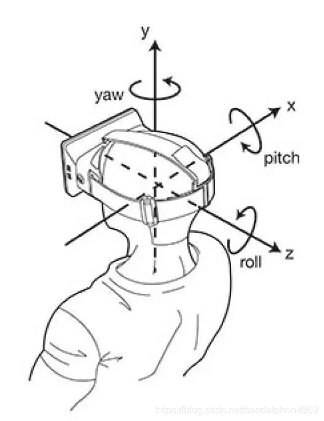
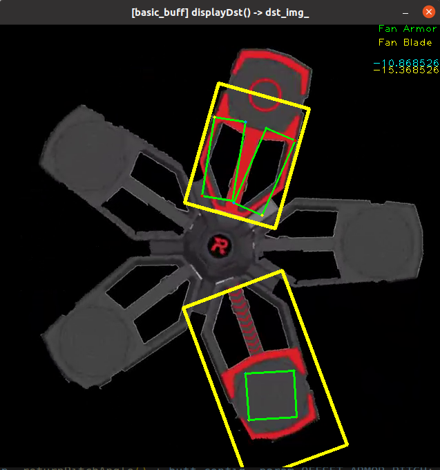

# 开发文档

## 大能量机关改动

### 2022/2023




### 2021



## 轴的示意图



## 串口通信

### 接收数据

#### 数据表格


| 数据位 | 内容                      | 解释                                                         |
| :----- | :------------------------ | :----------------------------------------------------------- |
| 0      | 头帧                      | ‘S’ (0x53)                                                   |
| 1      | 颜色                      | ALL (0), RED (1), BLUE (2)                                   |
| 2      | 模式                      | 0~9 (见表格后注释)                                           |
| 3      | 机器人 ID                 | 英雄 HERO (0), 无人机 UAV (1), 工程机器人 ENGINEERING (2), 步兵 INFANTRY (3), 哨兵 SENTRY (4) |
| 4      | yaw轴陀螺仪低八位         | 二进制数 (换算见注释)，单位：角度                            |
| 5      | yaw轴陀螺仪数据高八位     | 二进制数 (换算见注释)，单位：角度                            |
| 6      | pitch轴陀螺仪低八位       | 二进制数 (换算见注释)，单位：角度                            |
| 7      | pitch轴陀螺仪数据高八位   | 二进制数 (换算见注释)，单位：角度                            |
| 8      | yaw轴陀螺仪加速度低八位   | 二进制数 (换算见注释)，单位：角度                            |
| 9      | yaw轴陀螺仪加速度高八位   | 二进制数 (换算见注释)，单位：角度                            |
| 10     | pitch轴陀螺仪加速度低八位 | 二进制数 (换算见注释)，单位：角度                            |
| 11     | pitch轴陀螺仪加速度高八位 | 二进制数 (换算见注释)，单位：角度                            |
| 12     | 子弹速度                  | 二进制数 (换算见注释)，单位：m/s                             |
| 13     | 尾帧                      | ‘E’ (0x45)                                                   |

#### 注释

1.模式:

| 参数 | 枚举类型标识符           | 模式                     |
| ---- | ------------------------ | ------------------------ |
| 0    | DEFAULT_MODE             | 默认模式（基础自瞄模式） |
| 1    | AUTO_AIM                 | 基础自瞄模式             |
| 2    | ENERGY_BUFF              | 能量机关模式             |
| 3    | SENTRY_STRIKE_MODE       | 击打哨兵模式             |
| 4    | TOP_MODE                 | 反小陀螺模式             |
| 5    | RECORD_MODE              | 内录模式                 |
| 6    | PLANE_MODE               | 无人机模式               |
| 7    | SENTINEL_AUTONOMOUS_MODE | 哨兵模式                 |
| 8    | RADAR_MODE               | 雷达模式                 |
| 9    | CAMERA_CALIBRATION       | 相机标定模式             |

2.二进制数换算：

| 完整数据总位数 | 接收换算                                                   |
| -------------- | ---------------------------------------------------------- |
| 16             | 合并高低八位接收为short (int16_t)类型转换为float类型后/100 |
| 8              | 接收为unsigned char (u_int8_t)类型转换为float类型/10       |

### 发送数据

#### 数据表格


| 数据位 | 内容                                  | 解释                                                         |
| :----- | :------------------------------------ | :----------------------------------------------------------- |
| 0      | 头帧                                  | ‘S’ (0x53)                                                   |
| 1      | 装甲板数量 / 是否识别到能量机关装甲板 | 识别到的机器人装甲板数量 / 能量机关：未发现目标 (0) 发现目标 (1) |
| 2      | 开火命令                              | 不开火(0) 开火 (1)                                           |
| 3      | yaw 轴增加量低八位                    | 二进制数 (换算见注释)，单位：角度                            |
| 4      | yaw 轴增加量低高八位                  | 二进制数 (换算见注释)，单位：角度                            |
| 5      | pitch 轴增加量低低八位                | 二进制数 (换算见注释)，单位：角度                            |
| 6      | pitch 轴增加量低高八位                | 二进制数 (换算见注释)，单位：角度                            |
| 7      | 预测坐标x低八位                       | 二进制数 (换算见注释)，单位：像素                            |
| 8      | 预测坐标x高八位                       | 二进制数 (换算见注释)，单位：像素                            |
| 9      | 预测坐标y低八位                       | 二进制数 (换算见注释)，单位：像素                            |
| 10     | 预测坐标y高八位                       | 二进制数 (换算见注释)，单位：像素                            |
| 11     | 深度低八位                            | 二进制数 (换算见注释)                                        |
| 12     | 深度高八位                            | 二进制数 (换算见注释)                                        |
| 13     | CRC 校验位                            | CRC8                                                         |
| 14     | 尾帧                                  | ‘E’ (0x45)                                                   |

#### 注释

1.二进制数换算：

| 完整数据总位数       | 发送换算                                                |
| -------------------- | ------------------------------------------------------- |
| 16 (raw & pitch)     | 原始数据*100去尾转换为short (int16_t)类型再拆分高低八位 |
| 16 (预测坐标 & 深度) | 直接拆分高低8位即可                                     |
| 8                    | 原始数据*10去尾转换为unsigned char (u_int8_t)类型       |


## 一些命令

```
cd ***
git add .
git commit -m "commit"
git push -u origin main
```

## 一些代码

### opencv

##### 图像矩阵复制

```
Mat src = imread("test.jpg");
Mat dst = src.clone();
```

## 一些图片




## 日志

2023-01-13 新增串口通信数据12～15（预测坐标高低8位、区域长、区域宽）

2023-01-31 修复输入串口数据问题，增加部分数据

2023-02-01 串口通信第一版修改完成

​                     串口协议开发文档第一版修改完成

2023-02-09 装甲板自瞄V1.0