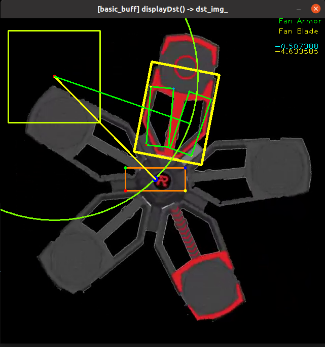

# 开发文档

## 大能量机关改动

### 2022/2023


### 2021


## 轴的示意图


## 串口通信

------

接收下位机数据
| 头帧 | 数据 1 | 数据 2 | 数据 3    | 数据 4          | 数据 5          | 数据 6          | 数据 7          | 数据 8            | 数据 9            | 数据 10           | 数据 11           | 数据 12            | 数据 13            | 数据 14      | 尾帧 |
| ---- | ------ | ------ | --------- | --------------- | --------------- | --------------- | --------------- | ----------------- | ----------------- | ----------------- | ----------------- | ------------------ | ------------------ | ------------ | ---- |
| 0x53 | 颜色   | 模式   | 机器人 ID | yaw轴陀螺仪数据 | yaw轴陀螺仪数据 | yaw轴陀螺仪数据 | yaw轴陀螺仪数据 | pitch轴陀螺仪数据 | pitch轴陀螺仪数据 | pitch轴陀螺仪数据 | pitch轴陀螺仪数据 | 陀螺仪加速度高八位 | 陀螺仪加速度低八位 | 当前子弹速度 | 0x45 |

```text
数据1：颜色 0为己方红色 1为己方蓝色 2为己方红蓝双色（调试模式）
数据2：模式 0为自瞄 1为小能量机关 2为大能量机关 3为打击哨兵模式 4为小陀螺模式 5为录像模式 6为无人机模式 7为哨兵模式 8为雷达模式 其余情况默认为自瞄模式
数据3：当前机器人ID 0为英雄 1为工程 2为步兵 3为无人机 4为哨兵
数据4~7：yaw轴的陀螺仪数据（联合体）
数据8~11：pitch的陀螺仪数据（联合体）
数据12~13：陀螺仪的加速度
数据14：当前子弹速度m/s 8 10 16 15 18 30
```

发送至下位机数据

| 头帧 | 数据 1   | 数据 2   | 数据 3       | 数据 4       | 数据 5       | 数据 6         | 数据 7       | 数据 8       | 数据 9     | 数据 10    | 数据 11    | 数据 12    | 数据 13    | 数据 14    | 数据 15    |     尾帧 |
| ---- | -------- | -------- | ------------ | ------------ | ------------ | -------------- | ------------ | ------------ | ---------- | ---------- | ---------- | ---------- | ---------- | ---------- | ---------- | ---- |
| 0x53 | 识别标志 | 射击信息 | yaw 轴正负号 | yaw 轴低八位 | yaw 轴高八位 | pitch 轴正负号 | pitch 低八位 | pitch 高八位 | 深度低八位 | 深度高八位 | CRC 校验位 | 预测坐标高八位 | 预测坐标第八位 | 区域长 | 区域宽 | 0x45 |

```text
数据1：是否识别到目标的标志 0为无目标 1为有目标
数据2：是否射击的信号 0为停止射击 1为允许射击
数据3：yaw 轴的正负号 0为负号 1为正号
数据4|5：yaw 轴角度
数据6：pitch 轴的正负号 0为负号 1为正号
数据7|8：pitch 轴角度
数据9|10：深度信息
数据11：CRC校验位
```

## 一些命令

```
cd ***
git add .
git commit -m "commit"
git push -u origin main
```

## 一些代码

### opencv

##### 图像矩阵复制

```
Mat src = imread("test.jpg");
Mat dst = src.clone();
```

## 一些图片




## 日志

2023-01-13 新增串口通信数据12～15（预测坐标高低8位、区域长、区域宽）